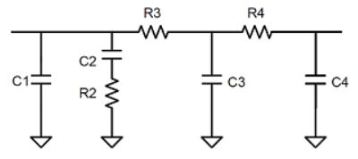

# Behavior-modeling-of-PLL
The project is refer to the Github project below:
[<i>/MathWorks-Excellence-in-Innovation/projects/Behavioral Modelling of Phase-Locked Loop using Deep Learning Techniques/</i>](https://github.com/mathworks/MathWorks-Excellence-in-Innovation/tree/main/projects/Behavioral%20Modelling%20of%20Phase-Locked%20Loop%20using%20Deep%20Learning%20Techniques)

The words below are some explanation of our work.

## Function Description
The final fitting function derived from our final trained neural network model os stored in the folder <i>"final_function"</i>.

In that folder, there are 7 fitting functions, functions <i>"fitA"</i> to <i>"fitF"</i> are individual Neural Network fitting functions of 15 input parameters to 6 output parameters, respectively. Besides, the function <i>"fitNet"</i> is the total function that calls functions from <i>"fitA"</i> to <i>"fitF"</i>, which could estimate 15 input parameters and obtain 6 output parameters at the same time.

## Our Dataset
The dataset used in the experiment is obtained through the Integer N PLL with Single Modulus Prescaler simulation model in the Mixed-Signal Blockset extension provided by MATLAB. 
**NOTE:** The specific MATLAB version is R2020a.

##### INPUT/OUTPUT Parameters
The 15 input parameters we focus on are: deadband compensation for PDF, output current and leakage current for charge pump, voltage sensitivity and free running frequency for VCO, clock divider value for prescaler, resistor and capacitor values for loop filter and the frequency of the PLL reference signal. 

The 6 output parameters we focus on are: the operating frequency and lock time of the PLL, phase noise of the PLL at 200KHz, 1MHz, 3MHz and 10MHz from the operating frequency offset.

##### Dataset Element Description
For each row of input parameters, recorded from left to right are the frequency of the PLL reference signal, deadband compensation, output current, leakage current, current imbalance, clock divider value, voltage sensitivity, free running frequency, C1 to C4 and R2 to R4 in the 4th order loop filter model. 
||
|:---:|
|*4th order loop filter*|

For each row of output parameters, recorded from left to right are operating frequency, lock time and the phase noise of the PLL at 200KHz, 1MHz, 3MHz and 10MHz from the operating frequency offset. 

##### Dataset Files Description

We have divided all the data obtained into training and test datasets. The <i>"input_nn.mat"</i> and <i>"output_nn.mat"</i> files store the input parameters and output parameters of our test set respectively. The test set has a total of 105 sets of data and each row is a corresponding set of simulation results. 

The <i>"training_dataset.mat"</i> file stores the training set we obtained. The training set has a total of 942 sets of data, each row represents one of our simulation examples, including the input and output parameters we are concerned about.The arrangement order of each parameter is consistent with the test set. 

## Fitting Result
The average error for six output parameters on our test dataset is as follows:
|Output parameters| Errors|
|:--:|:--:|
|Operating frequency|2.38%|
|Lock time|5.93%|
|Phase noise(Δf=200KHz)|  10.97%|
|Phase noise(Δf=1MHz)  |  8.50% |
|Phase noise(Δf=2MHz)  |  8.65% |
|Phase noise(Δf=10MHz) |  6.92% |

[loopfilter]:data:image/jpeg
